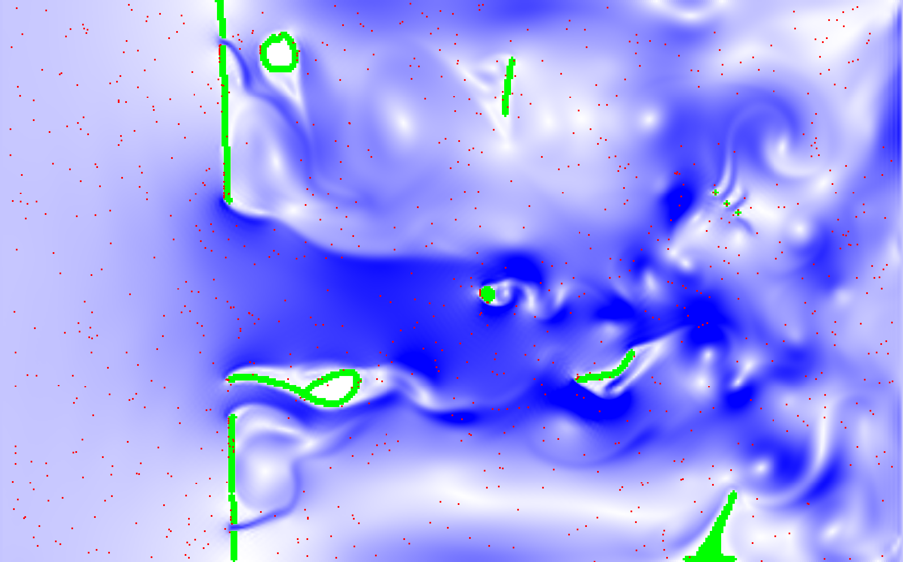

# lattice-boltzmann-play

A real-time multithreaded 2d flow simulator supporting arbitrary voxel geometry

## Building

`nix run` or `nix develop` and `cargo run --release`. Changing grid size or physical parameters
requires recompilation.

